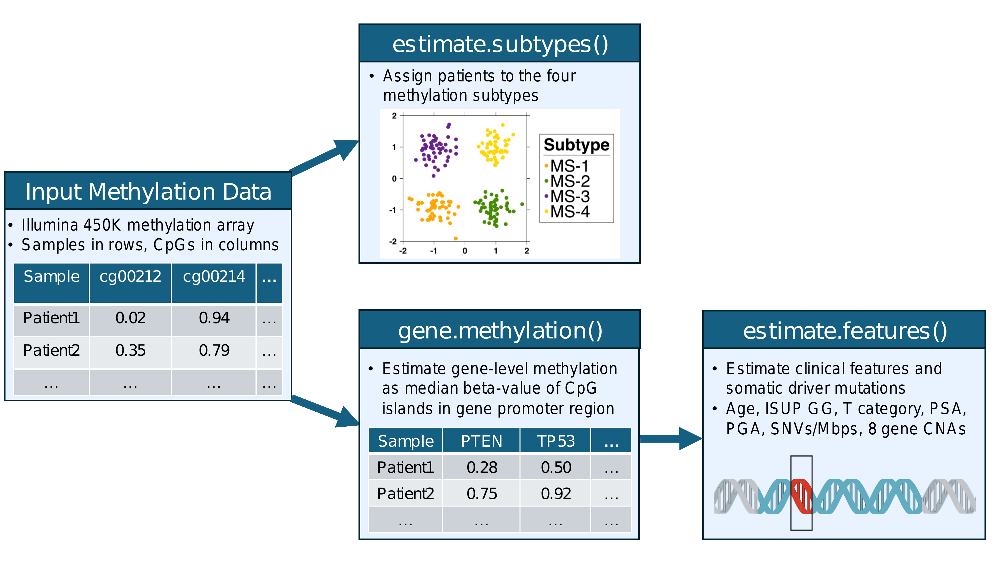

```{r setup}
library(PrCaMethy);
```

# Background

The `PrCaMethy` package provides resources for predicting clinical and molecular
features from prostate cancer DNA methylation data. Here is an overview of this vignette:

* [Input data] explains the required format of the input data
* [`estimate.subtypes`] assigns patients to one of four prostate cancer DNA methylation subtypes.
* [`gene.methylation`] calculates gene-level methylation
* [`estimate.features`] predicts clinical and molecular features
* [Quick start: putting it all together] gives a concise example for how to use the functions of this package.

An overview of the 3 main R functions is shown in the diagram below:

```{r, echo = FALSE}
;
```


# Input data

Users input a `data.frame` containing beta-values (continuous proportions from 0 to 1) of [CpG sites](https://en.wikipedia.org/wiki/CpG_site#:~:text=such%20as%20microRNAs.-,Methylation%20of%20CpG%20islands%20stably%20silences%20genes,causes%20stable%20silencing%20of%20genes.) from the Illumina Infinium Methylation 450K BeadChip array.
A list of these CpGs and their annotation data can be obtained from the [IlluminaHumanMethylation450kanno.ilmn12.hg19 R package](https://www.bioconductor.org/packages/release/data/annotation/html/IlluminaHumanMethylation450kanno.ilmn12.hg19.html).

Ideally, the user would have all ~480k CpGs from the Illumina 450K methylation array.
However, the functions in this package are written to try and estimate as many features as possible given the CpGs you have.

Here is an example dataset used throughout this tutorial:

```{r example data}
data(example.data, package = 'PrCaMethy');
dim(example.data);
example.data[,1:5];
```

Notice the patients are in rows (rownames give patient ids) and CpGs are in columns with CpG ids as the column names.

# `estimate.subtypes`

After making sure your methylation dataset is in the correct format (see [Input data]),
then you can use `estimate.subtypes` to assign each patient to one of four prostate cancer DNA methylation subtypes (named 'MS-1' to 'MS-4').  The subtypes are derived in a [forthcoming manuscript](https://www.biorxiv.org/content/10.1101/2025.02.07.637178v1).

First, let's check whether we have the required CpGs for predicting the subtypes:

```{r validate subtype model cpgs}
check <- validate.subtype.model.cpgs(example.data);
check$val.passed;
```

* `check$val.passed` a logical indicating whether the data passed validation
* `check$required.cpgs` a vector of CpG ids that are required for predicting the subtypes
* `check$missing.cpgs` a vector of CpG ids that are required but completely missing in the data
* `check$required.cpgs.with.high.missing` a vector of CpG ids that are required and have a proportion of missing values greater than `prop.missing.cutoff` (default is 0.3)

Given that the validation passed, we have all required CpGs for predicting the subtypes:

```{r predict subtypes, warning = FALSE}
subtypes <- estimate.subtypes(
    methy.data = example.data
    );
subtypes;
```

From our manuscript, the subtypes are interpreted as follows:

* MS-1 and MS-2 had better prognosis with MS-2 being most similar to normal tissue
* MS-4 had the highest risk of biochemical disease recurrence, followed by MS-3.
* MS-4, followed by MS-3, had higher risk of copy number alterations, somatic driver mutations and higher global mutation density.

# `gene.methylation`

Before we can predict other clinical and molecular features, we need to calculate gene-level methylation.
Specifically, gene-level methylation is calculated as the median beta-value among CpG islands in the gene promoter region.

To calculate the gene-level methylation, you would run the following code (this may take several minutes):

```{r, eval = FALSE}
example.data.gene.methy <- gene.methylation(example.data);
```

However, to save time, we precomputed the above dataset which you can use for the rest of the tutorial:

```{r example gene methy data}
data(example.data.gene.methy, package = 'PrCaMethy');
dim(example.data.gene.methy);
example.data.gene.methy[,1:5];
```


# `estimate.features`

Now that we have gene-level methylation data, we can predict several clinical and molecular features.
The models used to predict these features were derived and validated in a [forthcoming manuscript](https://www.biorxiv.org/content/10.1101/2025.02.07.637178v1).

Currently the package supports predicting the following features:

```{r features supported}
data(all.models, package = 'PrCaMethy');
features <- names(all.models);
features <- sapply(
    X = features,
    FUN = function(x) {
      n.required.genes <- length(all.models[[x]]$xNames);
      }
    );
features <- data.frame(feature = names(features), n.required.genes = features);
rownames(features) <- NULL;
features[order(features$n.required.genes),];
```

* `n.required.genes` lists the number of required genes to predict that feature.  You can see the required gene names by `lapply(all.models, function(x) x$xNames)`.
* Feature names with prefix "log2p1" means a $log_2(x + 1)$ transformation was applied.

To check whether you have the required genes to predict each feature:

```{r validate gene methy data}
check <- validate.gene.methy.data(
    gene.methy.data = example.data.gene.methy,
    models = all.models
    );
```

* `check$val.passed` is a boolean vector indicating whether you have the required genes to predict all features.
* `check$features.you.can.predict` logical vector indicating which features you can predict (i.e. you have the required genes with missing data rates < `prop.missing.cutoff`)
* `check$required.genes` is a list of required genes for predicting each feature.
* `check$missing.genes` is a list of missing genes that are required for predicting each feature.
* `check$required.genes.with.high.missing` is a list of genes that you have but that have high missing data (i.e. proportion of missing data exceeds the cutoff to argument `prop.missing.cutoff`, default = 0.3)

```{r}
check$val.passed;
```

Given that our data passed the validation, this means we can predict all features for our dataset:

```{r predict features}
features <- estimate.features(
    gene.methy.data = example.data.gene.methy,
    models = all.models
    );
```

```{r}
str(features$features);
```


# Quick start: putting it all together

In the previous sections, we called different `validate` functions to verify our data was correct.
This was for educational purposes, but actually the `validate` functions are called automatically by other functions, thus we can simplify our code:

```{r quick start, eval = FALSE}
library(PrCaMethy);

### prepare your data
# patients are in rows (rownames give patient ids) with CpG ids as the column names.
data(example.data, package = 'PrCaMethy');
example.data[,1:5];

### predict methylation subtypes
subtypes <- estimate.subtypes(
    methy.data = example.data
    );
table(subtypes$subtype);

### calculate gene methylation data
example.data.gene.methy <- gene.methylation(example.data);
example.data.gene.methy[,1:5];

### predict clinical and molecular features
features <- estimate.features(
    gene.methy.data = example.data.gene.methy,
    models = all.models
    );
str(features$features);
```

Lastly, you can merge the predicted subtypes and features into a single `data.frame`:

```{r merge outputs}
results <- merge(
    x = subtypes,
    y = features$features,
    by = 'row.names',
    all = TRUE
    );
str(results);
```
